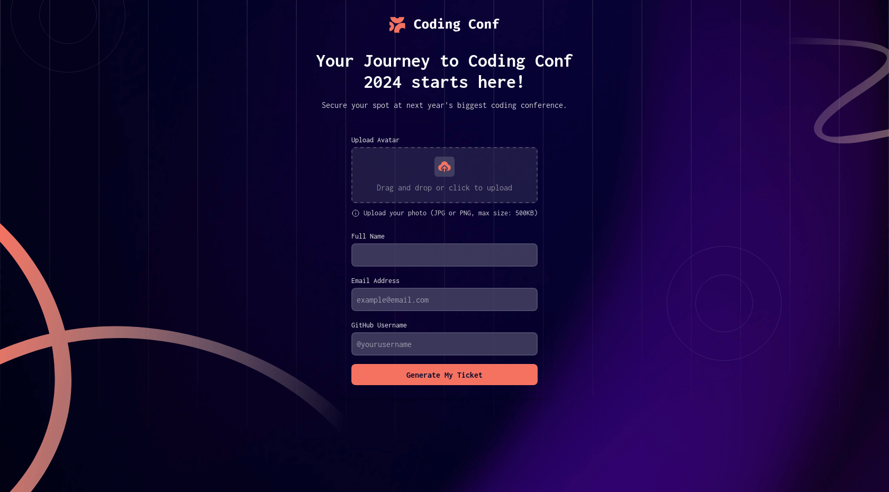

# Frontend Mentor - Conference ticket generator solution

This is a solution to the [Conference ticket generator challenge on Frontend Mentor](https://www.frontendmentor.io/challenges/conference-ticket-generator-oq5gFIU12w). Frontend Mentor challenges help you improve your coding skills by building realistic projects.

## Table of contents

- [Overview](#overview)
  - [The challenge](#the-challenge)
  - [Screenshot](#screenshot)
  - [Links](#links)
- [My process](#my-process)
  - [Built with](#built-with)
  - [What I learned](#what-i-learned)
  - [Continued development](#continued-development)
- [Author](#author)
- [Acknowledgments](#acknowledgments)

## Overview

### The challenge

Users should be able to:

- Complete the form with their details
- Receive form validation messages if:
  - Any field is missed
  - The email address is not formatted correctly
  - The avatar upload is too big or the wrong image format
- Complete the form only using their keyboard
- Have inputs, form field hints, and error messages announced on their screen reader
- See the generated conference ticket when they successfully submit the form
- View the optimal layout for the interface depending on their device's screen size
- See hover and focus states for all interactive elements on the page

### Screenshot



### Links

- Solution URL: [Solution URL here](https://github.com/wyasyn/Conference-Ticket-generator.git)
- Live Site URL: [Live site URL here](https://conference-ticket-generator.netlify.app/)

## My process

### Built with

- Semantic HTML5 markup
- CSS custom properties
- Flexbox
- CSS Grid
- Mobile-first workflow
- [React](https://reactjs.org/) - JS library
- [Motion](https://motion.dev/) - Animation Library
- [Tailwindcss](https://tailwindcss.com/) - For styles

### What I learned

I learned the use of the context-api for state management, motion for animation and practiced more JS to be more fluent like use of random numbers to generate the ticket number and transitions

The use multiple backgrounds was a challenge but figured it out by reviewing the docs such as;

```js
backgroundImage: {
        desktop: "url('/pattern-lines.svg'), url('/background-desktop.png')",
        mobile: "url('/pattern-lines.svg'), url('/background-mobile.png')",
        tablet: "url('/pattern-lines.svg'), url('/background-tablet.png')",
        ticket: "url('/pattern-ticket.svg')",
      },
```

Also making gradient text was a challenged, but by Googling, I came up with a good solution.

```js
<span className="bg-gradient-to-r from-primary to-foreground bg-clip-text text-transparent">
  {ticket.fullName}
</span>
```

### Continued development

I would like to learn more the use of Redux and Zustand for state management and Tan Stack Query.

## Author

- Website - [ywalum](https://www.ywalum.com)
- Frontend Mentor - [@wyasyn](https://www.frontendmentor.io/profile/wyasyn)
- Twitter - [@wyasyn](https://www.twitter.com/wyasyn)

## Acknowledgments

I would like to give thanks to the following people that have given me confidence to write code and simplified teaching in the best way, Thank you:

- Kevin Powell
- Dave Gray
- Web Dev Simplified
